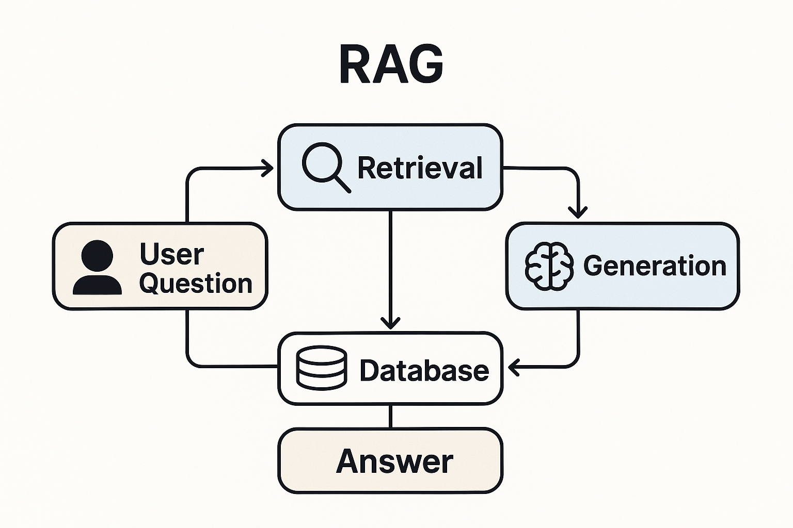

# 生成式 AI 專案集

這個資料庫收錄了多個與 **生成式 AI** 有關的程式實作與實驗。  
內容涵蓋自然語言處理、影像生成、資料模擬以及互動應用等主題。  
每個專案皆以獨立模組呈現，目標在於：

- 探索生成式模型的核心概念  
- 提供可重現、可實際操作的程式範例  
- 展示生成式 AI 在不同領域的應用可能性  

---

## 目錄 (Table of Contents)

1. [函數圖形繪製](#1-函數圖形繪製)  
2. [DNN 手寫數字辨識](#2-DNN-手寫數字辨識)  
3. [GAN 基礎實作](#3-GAN-基礎實作)  
4. [Prompt 測試基準](#4-模型-Prompt-測試基準)  
5. [互動式對話機器人](#5-互動式對話機器人)
6. [進階版互動式對話機器人](#6-進階版互動式對話機器人)
7. [RAG 音樂推薦系統](#7-RAG-音樂推薦系統)
8. [](#)
9. [](#)
10. [](#)
11. [](#)

---

## 1. 函數圖形繪製

**用途**：  
本專案示範如何利用 Python 視覺化 **Beta 分配** 的機率密度函數，並比較在不同參數條件下的分布形狀。  

**特色**：  
- 使用 `scipy.stats.beta` 建立 Beta 分配的 PDF。  
- 將參數設定為 \(a=b\)，觀察分布的對稱性與集中性。  
- 顯示不同參數下的圖形變化，從均勻分布到集中於 0.5 附近的尖峰分布。  

### 環境需求
- Python 3.8+  
- 套件：`numpy`、`pandas`、`matplotlib`、`seaborn`、`scipy`

### 安裝
```bash
pip install numpy pandas matplotlib seaborn scipy
```

## 2. DNN 手寫數字辨識

**用途**：  
本專案利用 **深度神經網路 (Deep Neural Network, DNN)** 訓練與測試 MNIST 手寫數字資料集，並提供互動式介面，讓使用者可以即時手寫數字並進行辨識。  

**特色**：  
- 採用 4 層全連接神經網路：  
  - 第一層：256 個神經元  
  - 第二層：128 個神經元  
  - 第三層：64 個神經元  
  - 第四層：32 個神經元  
- 使用 **MNIST 資料集**進行訓練與測試。  
- 提供 **Gradio 互動式介面**，可直接手寫輸入數字並辨識結果。  
- 使用 `TensorFlow/Keras` 架構，程式結構清晰。  

### 環境需求
- Python 3.8+  
- 套件：`tensorflow`、`numpy`、`matplotlib`、`PIL`、`gradio`、`ipywidgets`

### 安裝
```bash
pip install tensorflow numpy matplotlib pillow gradio ipywidgets
```

## 3. GAN 基礎實作

**用途**  
本專案示範 **生成對抗網路 (Generative Adversarial Network, GAN)** 的基本原理與簡單實作，說明生成器與判別器如何透過對抗訓練學習模擬真實資料分布。  

**特色**  
- 使用 PyTorch 建立簡單的 **生成器 (Generator)** 與 **判別器 (Discriminator)**。  
- 目標資料：一維常態分布 \(N(2, 0.5^2)\)。  
- 展示 **GAN 對抗損失函數**的數學推導。  
- 訓練過程以圖表顯示分布的收斂情況。  

### ⚙️ 環境需求
- Python 3.8+  
- 套件：`torch`、`numpy`、`matplotlib`、`seaborn`  

### 💻 安裝
```bash
pip install torch numpy matplotlib seaborn
```

## 4. 模型 Prompt 測試基準

**用途**  
本專案進行 **跨模型基準測試**，比較不同大型語言模型 (LLM) 在相同主題與相同 Prompt 條件下的表現，觀察其在知識準確度、邏輯性與表達清晰度的差異。  

**特色**  
- 測試主題：**超現實主義 (Surrealism)**。  
- 參與模型：  
  - ChatGPT  
  - Llama 3.3 70B Specdec (Groq)  
- 設計多個基準問題 (Q1 ~ Q4)，涵蓋：  
  - 超現實主義的概念與解釋  
  - André Breton 的理論語錄  
  - 超現實主義與現實世界的關聯  
  - 如何詮釋與理解藝術作品中的象徵  

### ⚙️ 環境需求
- Python 3.8+  
- Jupyter Notebook  

### 💻 安裝
(無額外套件需求，僅需具備 Notebook 環境)  

## 5. 互動式對話機器人

**用途**  
本專案示範如何透過 **Groq API** 建立一個連接大型語言模型 (LLM) 的對話機器人，並提供互動式網站介面，讓使用者能與自訂角色進行對話。  

**特色**  
- 使用 **Groq API** 連接 Llama3 70B 模型。  
- 可讀取並設定 API 金鑰以確保安全存取。  
- 自訂對話機器人角色（此案例為「最Chill的Doggy style」）。  
- 建立簡易網站介面，支援即時對話互動。  

### ⚙️ 環境需求
- Python 3.8+  
- 套件：`requests`、`os`、`matplotlib`、`pandas`  
- Groq API 金鑰  

### 💻 安裝
```bash
pip install requests matplotlib pandas
```

## 6. 進階版互動式對話機器人

**用途**  
本專案示範如何使用 **Ollama** 與 OpenAI API 建立一個進階版對話機器人，支援 **持續對話功能**，可保留上下文訊息，讓回覆更自然流暢。  

**特色**  
- 使用 **Ollama** 安裝與執行本地模型伺服器。  
- 採用 `gemma3:4b` 模型。  
- 支援 **持續對話 (contextual conversation)**，能保留對話歷史。  
- 可於 **Google Colab** 環境執行。  
- 結合 **OpenAI API**，提供混合式聊天體驗。  

### ⚙️ 環境需求
- Python 3.8+  
- 工具：Ollama、Colab  
- 套件：`requests`、`os`、`matplotlib`、`pandas`  

### 💻 安裝與設定
安裝 **Ollama**：  
   ```bash
   curl -fsSL https://ollama.ai/install.sh | sh
   nohup ollama serve &
   ollama pull gemma3:4b
   ```

## 7. RAG 音樂推薦系統

**用途**  
本專案是一套基於 **Spotify 播放清單資料**的音樂推薦系統。  
使用者只需輸入心情描述或偏好條件，系統即可從預先抓取的播放清單資料中檢索並推薦符合情境的歌曲，打造個人化的聆聽體驗。  

**特色**  
- 使用 Spotify API 搜尋並爬取播放清單與歌曲資料。  
- 建立以 **心情關鍵字 + 音樂類型** 為基礎的檢索資料集。  
- 利用 **RAG (Retrieval-Augmented Generation)** 架構，提升推薦的準確性與相關性。  
- 支援多樣化的輸入，例如：  
  - 「放鬆」  
  - 「想提振精神」  
  - 「悲傷的台灣流行歌」  

### 系統架構圖



---

### ⚙️ 環境需求
- Python 3.9+  
- 套件：`spotipy`、`pandas`、`faiss`、`numpy`、`matplotlib`  

### 💻 安裝
```bash
pip install spotipy pandas faiss-cpu numpy matplotlib
```

### ▶️ 使用流程

1. **資料蒐集**  
   - 使用 `misuc_data_crawling.ipynb`，透過 **Spotify API** 搜尋並爬取播放清單與歌曲資訊。  
   - 匯出歌曲資料為 **CSV 檔**，作為後續檢索資料來源。  

2. **建立向量資料庫**  
   - 使用 `RAG_create_database.ipynb`，將歌曲資訊轉換為文本並嵌入向量空間。  
   - 建立 **FAISS 資料庫**，並儲存於 `faiss_db/`，後續查詢會依此檢索。  

3. **查詢與推薦**  
   - 使用 `RAG_query_system.ipynb`，輸入使用者需求（心情或音樂風格）。  
   - 系統會從向量資料庫中找到最相關的歌曲，並輸出推薦清單。  